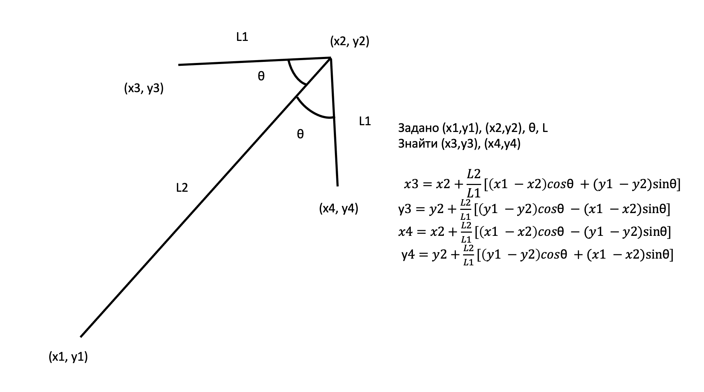
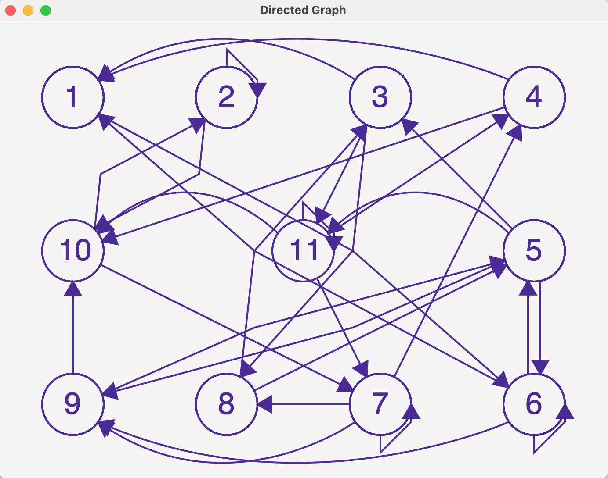

# Лабораторна 2.5 - "Обхід графа"
[Відео роботи](https://www.youtube.com/watch?v=XQhXgSSISPk)

Для графічного представлення використана [бібліотека GTK](https://www.gtk.org/docs/installations/)

В цій лабораторній компілюємо обидва файли з src/ папки. Для компіляції напишіть команду make з папки code/ в терміналі або:

``gcc -o main src/main.c src/matrix_tools.c -lm `pkg-config --cflags --libs gtk+-3.0` ``

На Windows і MacOS потрібно буде додатково встановити pkg-config.

Для побудови стрілки були використані формули:

Так виглядає фінальний варіант

